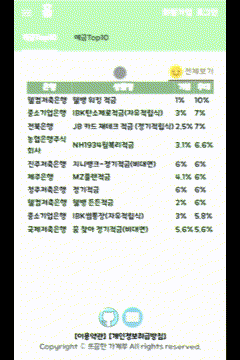

# Welcome  뜨끔한 가계부 🤑

> 뜨끔한 가계부 / 개인 토이프로젝트

🏠 [사이트 바로가기](https://cash.sundry.ninja)

## 📄Description
```sh
뜨끔한 가계부는 재테크가 중요한 시대의 다양한 금융정보를 사용자에게 제공 하며, 가계부 작성을 통한 소비습관 증진에 도움을 주기위한 사이트 제작을 목표로 하고 있으며 끊임없이 업데이트 할 예정입니다.
```

## 🔍서비스 기능
|날짜|기능|설명|
|----|---|---|
|N/A|반응형 지원| 각 디바이스에 맞게 UI 자동 크기 전환 |
|N/A|로그인/회원가입| 자체, KAKAO, NAVER 회원가입 및 로그인 기능 지원
|N/A|예금 조회| 시중의 은행, 저축은행에서 판매중인 예금목록 조회 구현
|N/A|적금 조회| 시중의 은행, 저축은행에서 판매중인 적금목록 조회 구현
|N/A|카드 CRUD| 가계부 작성에 사용할 자신이 소유중인 카드의 조회/등록/수정/삭제 구현
|N/A|카테고리 CRUD| 지출 내역 작성시 사용할 카테고리의 조회/등록/수정/삭제 구현
|N/A|소비 입출 CRUD| 날짜, 금액, 소비, 지출 상세 내역을 조회/등록/수정/삭제 구현
|N/A|가계부 CRUD| 용도에 따라 개인의 다양한 가계부 조회/등록/수정/삭제 구현

<br/>

> ### <span style="color:green">**TODO** 추가할 기능</span>

|날짜|기능|설명|
|----|---|---|
|미정|공유 가계부| 사용자간의 초대를 통한 가계부 공유작성
|미정|공유 가계부 권한 적용| 공유 가계부내의 권한을 추가하여 권한 별 기능 접근 추가
|미정|가계부 초대 및 알림 기능| 로그인 중인 사용자의 경우 Socket통신을 통하여 실시간으로 가계부 초대/수락/거절 상태를 사용자에게 알림을 주도록 구현

## 🔍Overview

- Main 화면 / 회원가입 / 로그인
  - 적금 / 예금 우대 이율 순으로 10개씩 보여줌.



- 카드 목록화면
  - 개인 사용자의 카드 조회/추가/수정/삭제 기능 


- 가계부 목록화면
  - 개인 사용자의 가게부 추가/수정/삭제 기능

